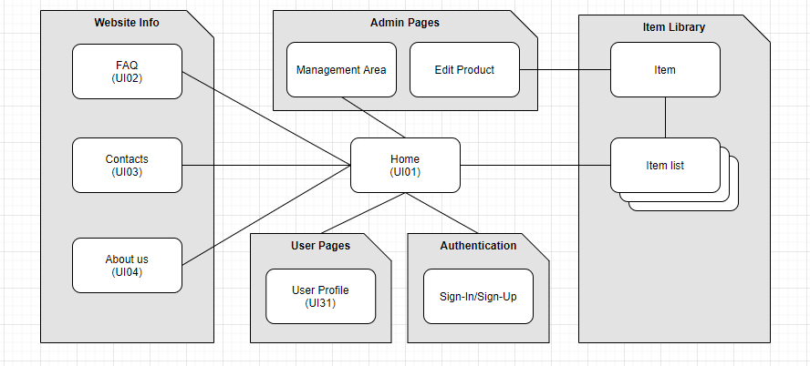
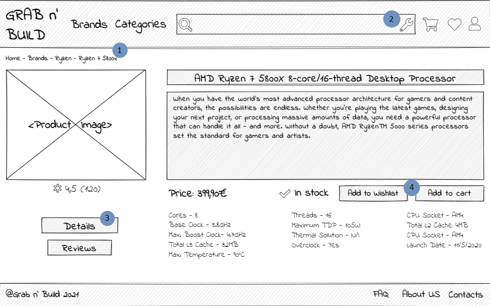
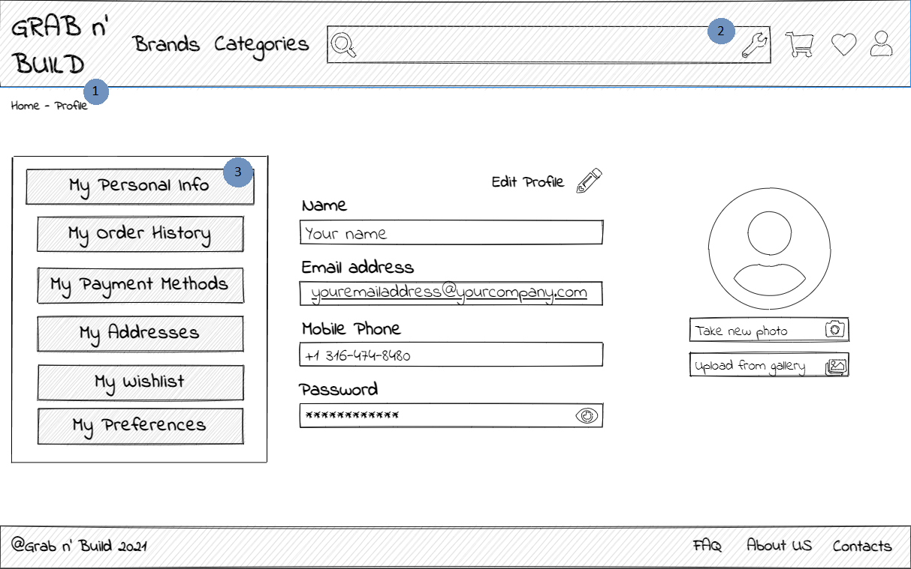

# ER: Requirements Specification Component

> Project vision.

## A1: Grab n' Build

The main goal of ***Grab n’ Build*** is to set up a web-based store to manage the listing and sale of computer parts, as well as their buyers. The store can be used by amateurs or professional computer enthusiasts building their computers.

All users, including guests, have the ability to Login and Logout, register a new account, recover passwords or delete their accounts, according to business rules, their data is kept but made anonymous. Users are also given access to search features, such as exact match search, full-text search, search over multiple attributes, search filters, with the ability to order results by characteristics such as price, the ability to list products and browse them by categories, view product details and reviews and manage a shopping cart by adding and removing products. Users are separated into two groups: ***System Administrators*** and ***Consumers***.

***System Administrators*** have, aside from default user permissions, the ability to administer other accounts (search, view, edit, create, block, unblock and delete). Aside from managing accounts, administrators can manage stock, add/delete products and manage their information, stock, category and discounts, as well as view their sales statistics. They can also view users' purchase histories and manage their orders and reports. This group is also in charge of editing some of the website’s pages like About, Contacts and FAQs. Although Administrators have their own accounts, they do not possess authenticated user privileges such as having a shopping cart or wishlist.

***Consumers*** are able to manage their shopping cart by adding or deleting items on it. Both authenticated and unauthenticated users can do it, but only those who possess an account are able to check-out. ***Consumers*** can also be split into two different actors: ***Guests*** and ***Authenticated Users***.

***Guests*** are unauthenticated users who have the ability to create an account (if they haven’t been registered into the system yet) and login into their own accounts.

***Authenticated Users*** have accounts, linked to a profile that can be viewed and edited by the owner, supporting a wishlist and personal notifications (which should inform of payment approval, change in the order processing stage, a wishlist product being made available and an update to the price of a product in their cart). When creating an order, this group of users should be able to change between multiple payment methods. Every purchase should be able to be viewed on a complete history.

If one places an order, the ***Buyer*** should be capable to check, track or even cancel the order if needed. 

***Reviewers*** are Buyers who can post a review about a product they acquired. Reviews should be treated not only editable (by the owner), but also deletable as well (by both review owner and System Administrators). 

The system should also support Help features such as placeholders for forms, contextual error messages and help, as well as Product Information: an “About Us”, listing of main features and contacts.

---

## A2: Actors and User stories

> This artefact contains the specification of the actors and their user stories, serving as agile documentation of the project requirements. 

### 1. Actors

    Figure 1: Actors diagram

| Identifier | Description |
| -------- | -------- |
| ***User***     | Generic User with access to public information.     | 
| ***Consumer***     | Generic User that can add products to his shopping cart, but can’t check them out, unless authenticated.     | 
| ***Administrator***     | Authenticated User that can’t check-out or make purchases but manages the website, from user reports to product management.     | 
| ***Authenticated User***     | Authenticated User that can access site features such as checking out and managing their account.     | 
| ***Guest***     | Unauthenticated User that can create an account and/or log in.     | 
| ***Buyer***    | Authenticated User who placed an order, with the ability to manage it, and even post a review.     | 
| ***Reviewer***     | Authenticated User that has placed a review and can manage, edit or delete it.     | 

### 2. User Stories

Each User Story are following the template **[Dennis10]**:
> As a ***[user]***, I want ***[function]***, so that ***[value]***

#### 2.1. User

| Identifier | Name | Priority | Description |
| -------- | -------- | -------- | -------- |
| US01     | Home    | High     | As a *User*, I want to access the Home page, so that I can be introduced to the website.     |
| US02     | FAQ     | High     | As a *User*, I want to access the FAQ page, so that I can look for an answer to a question I might have.     |
| US03     | Contacts     | High     | As a *User*, I want to access the Contacts Page, so that I can easily retrieve the website founders’ contacts.     |
| US04     | About     | High     | As a *User*, I want to access the About page, so that I can get to know what the website is focused on and how it was created.     |
| US05     | Search using the Navigation Menu     | High     | As a *User*, I want to search for a group of products using the navigation menu so that I can easily find what I’m looking for.     |
| US06     | Searching using the Search Bar     | High     | As a *User*, I want to search for products using the search bar, so that I can use keywords to find what I’m looking for more accurately.     |
| US07     | Filter serch results    | High    | As a *User*, I want to apply filters to search results, so that I can exclude products I’m not interested in.     |
| US08     | Sort search results     | High     | As a *User*, I want to sort the search results using an attribute, so that I can rearrange the list of results in a more accessible way.     |
| US09     | Access product page     | High    | As a *User*, I want to access a product page, so that I can get access to detailed information and specifications      |

#### 2.2. Consumer

| Identifier | Name | Priority | Description |
| -------- | -------- | -------- | -------- |
| US11     | Manage Cart    | High     | As a *Consumer*, I want to add/delete products to my shopping cart, so that I’m able to list what I can later check out.    |

#### 2.3. Administrator

| Identifier | Name | Priority | Description |
| -------- | -------- | -------- | -------- |
| US21     | Manage products    | High     | As an Admin, I want to add/delete products from the system, so that the product’s stock is up-to-date.     |
| US22     | Edit a product     | High     | As an Admin, I want to edit a product’s information, so that it reflects its characteristics.     |
| US23     | Manage categories     | High     | As an Admin, I want to add/delete categories from the system, so that the available categories and respective products can be displayed correctly.     |
| US24     | Edit Products Categories     | High     | As an Admin, I want to change a product’s category, so that it better fits into a group of products with similar characteristics.     |
| US25     | Delete Users     | High     | As an Admin, I want to delete user accounts, so that the user no longer exists in the system.     |
| US26     | Unblock User     | High     | As an Admin, I want to unblock User accounts, so that the banned Users can re-access the system’s privileged features.     |
| US27     | Block User     | High     | As an Admin, I want to block User accounts, so that the users are forbidden to access the system’s privileged features.     |
| US28     | Check a user purchase history     | High     | As an Admin, I want to check on the Users’ purchase history, so that I can be aware of all transactions occurred so far.    |
| US29     | Manage Order Status     | High     | As an Admin, I want to manage an order status, so that the User’s order can be tracked correctly.    |
| US210     | Manage FAQs     | High     | As an Admin, I want to add/delete FAQs, so that important and frequent questions are up-to-date.     |
| US211     | Edit FAQs     | High     |As an Admin, I want to edit FAQs, so that the questions and answers can be written more understandably.     |
| US212     | Edit Contacts Page     | High     | As an Admin, I want to edit the information displayed on the “Contacts” page, so that the owner’s contacts are up-to-date.     |
| US213     | Edit About Page     | Low    | As an Admin, I want to edit the information displayed on the “About” page, so that the website’s details are up-to-date.     |

#### 2.4. Authenticated User

| Identifier | Name | Priority | Description |
| -------- | -------- | -------- | -------- |
| US31     | Profile    | High    | As an Authenticated User, I want to view and edit my profile, to keep track of my information.     |
| US32     | Check Notifications     | High     | As an Authenticated User, I want to receive notifications, so that I am warned about events that might interest me: payment approval, change in the order processing stage, a wishlist product being made available and an update to the price of a product in my cart.    |
| US33     | Check-out     | High    | As an Authenticated User, I want to check-out my current cart, to purchase the items I’ve added to it.     |
| US34     | Payment     | High     | As an Authenticated User, I want to manage my payment methods and account credits, to control how I pay for my      |
| US35     | Delete Account     | High     | As an Authenticated User, I want to delete my account, to preserve my privacy.     |
| US36     | Report Reviews     |High     | As an Authenticated User, I want to report reviews I view as misleading, to keep products free of misinformation.     |
| US37     | Sign-out    | High     | As an Authenticated User, I want to log out of my account, so that I can close it out.     |
| US38     | Check Purchase History    | High     | As an Authenticated User, I want to view the history of my previous purchase, so that I can keep track of my expenditures in the system.     |
| US39     | Vote on a Review    | Medium     | As an Authenticated User, I want to vote if a review was helpful or not, so that the review becomes more trustworthy.     |
| US310     | Wishlist     | Low     | As an Authenticated User, I want  to manage a wishlist, to keep track of items I’d like to buy in the feature     |

#### 2.5. Guest

| Identifier | Name | Priority | Description |
| -------- | -------- | -------- | -------- |
| US41     | Sign-In     | High     | As a Guest, I want  to login into my account, so that I can get authenticated user privilege.     |
| US42     | Sign-Up     | High     |As a Guest, I want to create an account, so that I’m able to authenticate into the system.     |

#### 2.6. Buyer

| Identifier | Name | Priority | Description |
| -------- | -------- | -------- | -------- |
| US51     | View Order     | High     | As a Buyer, I want to check on my order, so that I can check on its details.     |
| US52     | Track Order     | High     | As a Buyer, I want to track my order, so that I know when it’s getting delivered.     |
| US53     | Cancel Order     | High     | As a Buyer, I want to cancel my order, so that I can get my money back.     |

#### 2.6. Reviewer

| Identifier | Name | Priority | Description |
| -------- | -------- | -------- | -------- |
| US61     | Post Review     | High     | As a Reviewer, I want to post a review, so that other people can view my opinion about a product.     |
| US62     | Edit Review     | High     | As a Reviewer, I want to edit my review, so that I can express my opinion more accurately.     |
| US63     | Delete review     | High     | As a Reviewer, I want to delete my review, so that the review becomes unavailable to other users.     |

### 3. Supplementary Requirements

This section contains tables for business rules, technical requirementes and restrictions.

#### 3.1. Business rules

A business rule defines or constrains one aspect of the business, with the intention of asserting business structure or influencing business behaviour. Business rules often supplement usage or user interface requirements; **[Ambler04]** 

| Identifier | Name | Description |
| -------- | -------- | -------- |
| BR01     | Deletion     | Shared user data, such as reviews, should be kept if the respective user deletes their account (US25/US35), with the author anonymized.     |
| BR02     | Administrators     | Administrators are independent of regular users and should not engage with purchasing features.     |
| BR03     | Delivery Date     | The delivery date must be greater than the purchase date for an item that has been purchased by a buyer.     |
| BR04     | Reviews     | Reviewers cannot vote for their own reviews.    |

#### 3.2. Technical requirements

Technical requirements are concerned with the technical aspects that the system must meet, such as performance-related issues, reliability issues and availability issues. Highlight and justify the three most critical technical requirements for your project. **[Ambler04]** 

| Identifier | Name | Description |
| -------- | -------- | -------- |
| TR01     | Performance     | The system’s response time should be less than 2s to reduce user frustration.     |
| TR02     | Robustness     | The system should continue running and be capable of handling runtime errors.     |
| TR03     | Scalability     |The system must be able to handle the growth of users and actions.     |
| TR04     | Accessibility     | The system must ensure it can be used by any user, regardless of possible disabilities they may have or web browsers used.     |
| **TR05**     | **Security**     | **The system shall protect sensitive information from unauthorised access through the use of an authentication system. This is critical as the system handles the payment and financial information and security failures could cost the users.**     |
| **TR06**     | **Ethics**     | **The system must respect ethical principles with regards to data collection and sharing (must require user acknowledgement). As the system handles purchases and users’ payment information, ensuring trust is critical.**     |
| **TR07**     | **Web Application**     | **The system is to be implemented as a web application with dynamic pages, utilizing standard HTML, CSS etc. Users must be able to access and use the site using standard web software.**     |

#### 3.3. Restrictions

A restriction on the design limits the degree of freedom in the search for a solution. 

***No restrictions created for this system***

---

## A3: Information Architecture

The Information Architecture artefact provides a high-level overview of the system's information architecture. 
The main objectives are listed below:
- Contribute to the identification and description of user needs, as well as the generation of new ones;
- Examine and test the UI of the product;
- Allow for several iterations of the user interface design in a short amount of time.

There are two components to this artefact:
- A sitemap;
- A pair of wireframes.

### 1. Sitemap

    Figure 2: Sitemap

### 2. Wireframes

A website wireframe is a visual representation of a website’s skeleton architecture. Below there are two wireframes, one is a representation of what the item page resembles, while the other one reveals how the user profile looks like.

#### UI01: Item page

    Figure 3: Wireframe 1

1. Breadcrumbs help the user navigate the website, making them aware of their current location within the website; 
2. The search feature is available throughout the whole website;
3. The selected tab is distinguishable from the unselected one due to its size.
4. Buyers can easily add products to their wishlist, as well as their cart; 

#### UI02: User Profile

    Figure 4: Wireframe 2

1. Breadcrumbs help the user navigate the website, making them aware of their current location within the website; 
2. The search feature is available throughout the whole website;
3. The selected tab is distinguishable from the unselected one due to its size.

---

## Revision history

Changes made to the first submission:
1. Item 1
1. ...

***
GROUP2175, 10/11/2021

* Group member 1 Carlos Veríssimo, up201907716 (Editor)
* Group member 2 Duarte Sardão, up201905497
* Group member 3 Nuno Jesus, up201905477
* Group member 4 Tomás Torres, up201800700 
